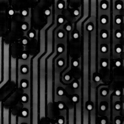
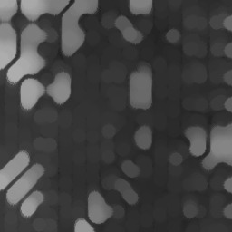
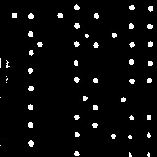

# Mettre en evidence les ronds blancs

Tout d'abord on definit un élément structurant qui ressemble aux éléments que l'on cherche à mettre en évidence.
On chosit donc un cercle 2D puis on fait un top hat de cet élément.
Le resultat est Rond Blancs.pgm

 

