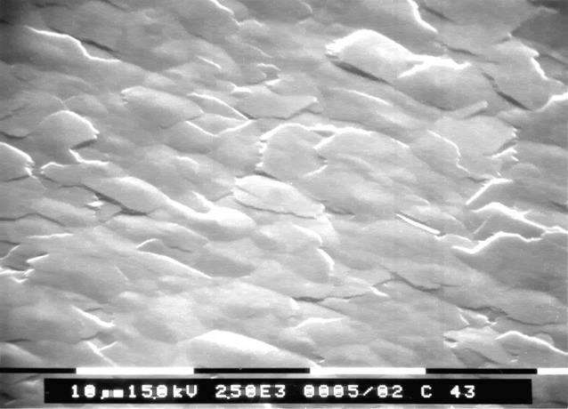

# Restauration

Pour éliminer les bandes noires parasites dans l'image il suffit de faire une passer l'image par une fermeture avec un élément structurant approprié.
Ici comme les bandes sont verticale , une ligne horizontale convient tout à fait pour mon élément structurant.*

