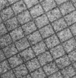
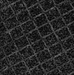
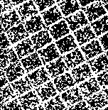
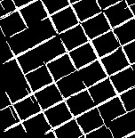

# Covariogramme angulaire

Pour mettre en valeur les lignes on effectue un gradient morphologique externe. avec un petit rond.
La ligne que j'ai choisi fait une vingtaine de pixel.
Ensuite on effectue le seuillage de notre image pour obtenir les deux versions qui sont demandés.
Une fois les deux versions obtenues ont etudie les differentes courbes de la somme des images en fonction de l'angle donné.
Avec un seuillage bien adaptée le resultat de ces courbes est sans appele : avec une image en niveau de gris les resultats sont trop incertains.
Avec le seuillage on voit bien les pics ou trop sans difficultés les deux orientations : 61° et 151°.

 

 