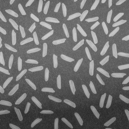
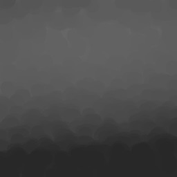
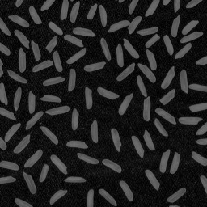
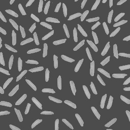

# Correction d'illumination

Pour traiter cette image on procède en plusieurs etapes.
Premièrement on isole le fonds avec une érosion et un élément structurant de rayon 10.
Ensuite on fait la difference mais le fonds est maintenant trop sombre même si il est uniforme.
Du coup on fait la moyenne du fonds que l'on rajoute sur le fond, quand au riz on fait pareil, on fait la moyenne de leurs illumination que on rajoute à la difference.

 

 